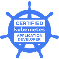

# Hi, I'm nishipy🐶

* Cloud Platform Engineer from Japan.
* Love dogs🐶, football⚽️ and cloud☁️
* <a class="twitter-follow-button" href="https://twitter.com/iamnishipy?ref_src=twsrc%5Etfw" data-show-count="true">Follow @iamnishipy</a>

## Grass-Graph

## GitHub Readme Stats

## Certifications

   and more.
